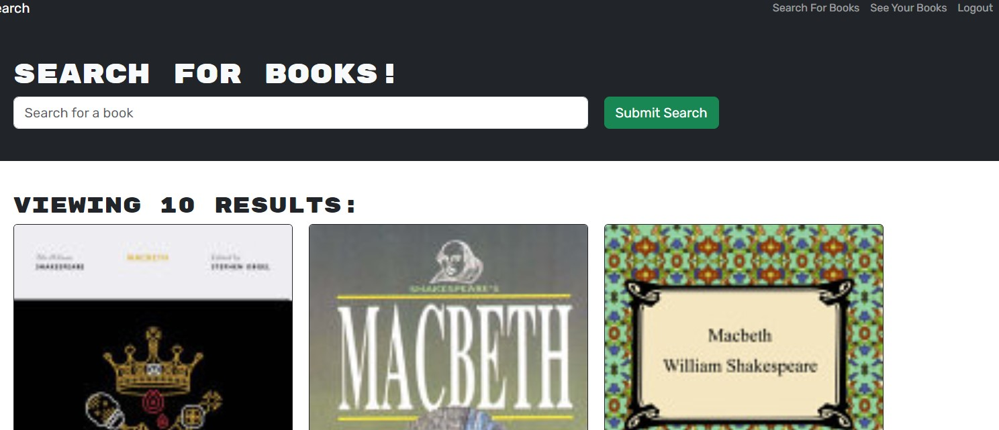

# Book-Search-Engine

## Table of Contents
- [Description](#description)
- [Installation](#installation)
- [Usage](#usage)
- [Technologies Used](#technologies)
- [License](#license)
 

## Description
This is a web application designed for a User to search books using Google Books API and save them to their own personal collection. The application allows the user to sign up or log-in and have access to all their saved books!
 

[Link to Deployed Application](https://lit-shore-21603-2e911712e820.herokuapp.com/)  

## Installation
Clone the repository and ensure you have Node.js installed.  
Once you've done that, open the terminal and run `npm install` to install the dependencies.  
Then, run `npm run start` to start the application into a local session @ https://localhost:3001/   
You will also be able to add `/graphql` at the end of the URL to go into Apollo @ https://localhost:3001/graphql   

## Usage

## Technologies

- VS Code  
- MERN  
- Webpack  
- GraphQL  
- Apollo  
- MongoDB  
- Mongo Atlas  

## License
The code in this project is licensed under MIT license.